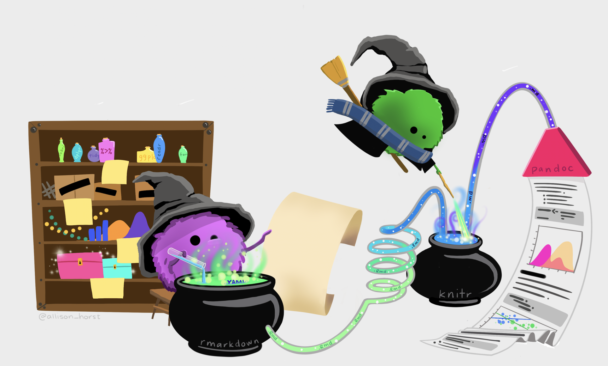

```{r fig.cap = "Artwork by @allison_horst.", fig.alt = "Two monsters working magic to come up with a complete data analysis and presentation.", preview = TRUE, echo = FALSE}

```


Throughout the semester, you will complete a series of mini-projects. The first project is the creation of a website connected to your GitHub account. Subsequent projects will be posted onto the website you create.  

Each individual project has instructions that are given separately, and will be graded according to the specific instructions. However, I encourage you to consider the overall project as a potential deliverable that you could include on a resume, show to future employers, discuss in graduate school interviews, etc. That is, approach the assignment as an opportunity for you to take something away from the class which is bigger than just a grade.


:::{.callout-tip icon=false}
### Dates
* 9.29.26 Project 1 due
* 10.13.26 Project 2 due 
* 11.3.26 Project 3 due
* 11.17.26 Project 4 due 
* 12.1.26 Project 5 due 
* 12.11.26 (Friday) or 12.18.26 (Friday) Project Presentations (9am-noon)
* 12.18.26 Project 6 write-up due (on GitHub by midnight) 
:::