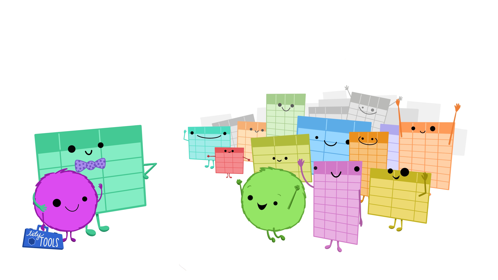

# Foundations of Data Science in R
## DS002R, Fall 2026

Jo Hardin   
2351 Estella   
jo.hardin@pomona.edu

Class: Mondays & Wednesdays, 11-12:15pm  
Estella 2141


**Office Hours: (Estella 2351)**  
Monday: 1:30-4:00pm  
Tuesday: 9-11am   
Thursday: 1:30-3pm 


**Mentor Sessions: (room TBD)**  
Monday: 8-10pm  
Tuesday: 8-10pm


```{r}
#| fig.cap: "Artwork by @allison_horst."
#| fig.alt: A group of personified tables getting together and seemingly very happy to see each other.
#| preview: TRUE
#| echo: FALSE

```

## The course 

**Foundations of Data Science in R** is a first course in data science. Data play an increasingly important role in many fields. Being able to understand data and the ethical implications in data driven decisions is paramount to being an informed member of society. As an introduction to data science with R, this course will introduce students to basic data science concepts. Prerequisite: CSCI004 or CSCI005 or CSCI051 or equivalent experience in programming. 


:::{.callout-tip icon=false}
## Anonymous Feedback

As someone who is, myself, constantly learning and growing in many ways, I welcome your feedback about the course, the classroom dynamics, or anything else you'd like me to know.  There is a link on Canvas to an anonymous feedback form.  Please feel free to provide me with feedback at any time!  
:::

## Student Learning Outcomes.
By the end of the term, students will be able to:

* scrape, process, and clean data from the web
* wrangle data in a variety of formats
* contextualize variation in data
* construct point and interval estimates using resampling techniques
* design accurate, clear and appropriate data graphics
* query large relational databases (using SQL)
* work fluently with regular expression
* communicate data-driven decisions


## Inclusion Goals

> Inclusive teaching is intentional and reflective. Inclusive teaching builds community, is student-centered, acknowledges the whole student, and is accessible to all students. Inclusive teaching develops critical and creative thinkers who positively contribute to our community.

The above definition of inclusive teaching was developed by Pomona faculty over the past few years, and it is what I aim to practice in our classroom. Please contact me if you have any suggestions to improve the quality of the course materials.

Furthermore, I would like to create a learning environment for my students that supports a diversity of thoughts, perspectives and experiences, and honors your identities (including race, gender, class, sexuality, religion, ability, etc.) To help accomplish this:

* If you have a name and/or set of pronouns that differ from those that appear in your official records, please let me know!
* If you feel like your performance in the class is being impacted by your experiences outside of class, please don't hesitate to come and talk with me.  You can also relay information to me via your mentors.  I want to be a resource for you. 

I (like many people) am still in the process of learning about diverse perspectives and identities. If something was said in class (by anyone) that made you feel uncomfortable, please talk to me about it. As a participant in course discussions, you should also strive to honor the diversity of your classmates.

## Technical Details

#### Text: 
<b> <a href = "https://mdsr-book.github.io/mdsr3e/" target = "_blank">Modern Data Science with R, 3rd edition</a></b> by Baumer, Kaplan, and Horton.

<b><a href = "https://r4ds.hadley.nz/" target = "_blank">R for Data Science, 2nd edition</a></b> by Wickham, Çetinkaya-Rundel, and Grolemund.


:::{.callout-tip icon=false}
### Dates
* Quizzes on Sep 23, Oct 7, Oct 26, Nov 11, Nov 23, and Dec 9 (in class)
* 9.29.26 Project 1 due
* 10.13.26 Project 2 due 
* 11.3.26 Project 3 due
* 11.17.26 Project 4 due 
* 12.1.26 Project 5 due 
* 12.11.26 (Friday) or 12.18.26 (Friday) Project Presentations (9am-noon)
* 12.18.26 Project 6 write-up due (on GitHub by midnight) 
:::

## Links to resources:

### Git resources

:::note
* Best and most comprehensive Git help: <a href="http://happygitwithr.com/" target="_blank">http://happygitwithr.com/</a>
* Git within Positron: <a href = "https://positron.posit.co/git.html" target = "_blank">https://positron.posit.co/git.html</a>
* <a href="http://swcarpentry.github.io/git-novice/" target="_blank">Version control with Git</a>
* <a href="https://aberdeenstudygroup.github.io/studyGroup/lessons/SG-T1-GitHubVersionControl/VersionControl/#2.4.2." target="_blank">More on Git</a>
* <a href="https://git-scm.com/book/en/v2" target="_blank">Online Git book</a> with lots of info
:::

### R resources

:::note
* A fantastic <a href="https://www.cedricscherer.com/2019/08/05/a-ggplot2-tutorial-for-beautiful-plotting-in-r/" target="_blank">ggplot2 tutorial</a>
* Tutorials through the <a href="https://ourcodingclub.github.io/tutorials/" target="_blank">Coding Club</a>
* <a href="http://www.rseek.org/" target="_blank">Google for R</a>
* Helpful <a href="https://posit.co/resources/cheatsheets/" target="_blank">cheatsheets</a> from Positron.
   * <a href="https://rstudio.github.io/cheatsheets/html/data-transformation.html" target="_blank">data wrangling</a>
   * <a href="https://rstudio.github.io/cheatsheets/html/data-visualization.html" target="_blank">ggplot2</a>
   * <a href="https://rstudio.github.io/cheatsheets/html/shiny.html" target="_blank">Shiny</a>
   * <a href="https://rstudio.github.io/cheatsheets/html/quarto.html" target="_blank">Quarto</a>
   * <a href="https://rstudio.github.io/cheatsheets/html/positron.html" target="_blank">Positron IDE</a>
:::

### SQL resources

:::note
* W3 schools <a href = "https://www.w3schools.com/sql/sql_intro.asp" target = "_blank">Introduction to SQL</a>
* W3 schools <a href = "https://www.w3resource.com/sql-exercises/" target = "_blank">SQL Exercises, Practice, Solution</a>
* <a href = "https://cran.r-project.org/web/views/Databases.html" target = "_blank">R packages</a> for working with databases
* <a href = "https://dbplyr.tidyverse.org/articles/dbplyr.html" target = "_blank">Introduction to `dbplyr`</a>
:::

### Regular expression resources

:::note
* <a href = "https://cran.r-project.org/web/packages/stringr/vignettes/stringr.html" target = "_blank">**stringr** vignette</a>
* <a href = "https://stringr.tidyverse.org/" target = "_blank">**stringr** package</a>
* Jenny Bryan et al.'s <a href = "https://stat545.com/character-vectors.html" target = "_blank">STAT 545 notes</a>
* <a href = "http://regexpal.com/" target = "_blank">regexpal</a>   
* <a href = "http://www.regexr.com/" target = "_blank">RegExr</a>
* <a href = "https://regexone.com/" target = "_balnk">RegexOne</a>
:::


##### HW Grading

Homework assignments will be graded out of 5 points, which are based on a combination of accuracy and effort. Below are rough guidelines for grading.

[5] All problems completed with detailed solutions provided and 75% or more of the problems are fully correct. Additionally, there are no extraneous messages, warnings, or printed lists of numbers.  
[4] All problems completed with detailed solutions and 50-75% correct; OR close to all problems completed and 75%-100% correct. Or all problems are completed and there are extraneous messages, warnings, or printed lists of numbers. [<a href = "https://ds002r-fds.netlify.app/superfluous_material.html" target = "_blank">Here is an example</a> of extraneous messages and printed lists of numbers.]  
[3] Close to all problems completed with less than 75% correct. OR an assignment that didn't make it all the way to Canvas as the correctly rendered pdf.  
[2] More than half but fewer than all problems completed and > 75% correct.  
[1] More than half but fewer than all problems completed and < 75% correct; OR less than half of problems completed.  
[0] No work submitted, OR half or less than half of the problems submitted and without any detail/work shown to explain the solutions. You will get a zero if your file is not compiled and submitted on GitHub.  


## Projects:

There will be 5 mini-projects (due roughly every other week). You will also compile the projects, reflect on the process, and present your work to your classrmates. Project information is available here: [DS 002R Projects](/project/)


## Computing:

* GitHub will be used as a way to practice reproducible and collaborative science. There may be a slight learning curve, but knowing Git will be an extremely useful skill as you venture beyond this class.

* R will be used for all homework assignments. R is freely available at <a href="http://www.r-project.org/" target="_blank">http://www.r-project.org/</a> and is already installed on college computers. Additionally, you need to install Positron in order to use Quarto, <a href="https://positron.posit.co/" target="_blank">https://positron.posit.co/</a>. If you are not already familiar with R, please work through some of the materials provided ASAP. 

* You are welcome to use Pomona's Positron server at <a href="https://rstudio.campus.pomona.edu/" target="_blank">https://rstudio.campus.pomona.edu/</a> (or <a href="https://rstudio.pomona.edu" target="_blank">https://rstudio.pomona.edu</a> if you are off campus). If you use the server, you can connect directly to your Git account without installing Git locally on your own computer. [If you are not a Pomona student, you will need to get an account from Pomona's ITS. Go to ITS, tell them that you are taking a Pomona course, and ask for an account for using Positron.]

## Engagement:

* This class will be interactive, and your engagement is expected (every day in class). Although notes will be posted, your engagement is an integral part of the in-class learning process.

* In class: after answering one question, wait until 5 other people have spoken before answering another question. [Feel free to **ask** as many questions as often as you like!]

* To get full participation points, you will be expected to contribute at least one R tip of the day, sometime during the semester.
 	

#### Academic Honesty:

Throughout the semester, you will be challenged, and you may find yourself stuck.
Every single one of us has been there, I promise.
Below, I've provided Pomona's academic honesty policy.  But before the policy, I've given some thoughts on cheating which I have taken from Nick Ball's CHEM 147 Collective (thank you, Prof Ball!).
Prof Ball gives us all something to think about when we are learning in a classroom as well as on our journey to become scientists and professionals:

:::{.callout-tip icon=false}
## Why Cheat?
There are many known reasons why we may feel the need to "cheat" on problem sets or exams:

* An academic environment that values grades above learning.
* Financial aid is critical for remaining in school that places undue pressure on maintaining a high GPA.
* Navigating school, work, and/or family obligations that  have diverted focus from class.
* Challenges balancing coursework and mental health.
* Balancing academic, family, peer, or personal issues.

Being accused of cheating – whether it has occurred or not – can be devastating for students. The college requires me to respond to potential academic dishonesty with a process that is very long and damaging. As your instructor, I care about you and want to offer alternatives to prevent us from having to go through this process.
:::

If you find yourself in a situation where "cheating" seems like the only option, please come talk to me.  We will figure this out together.


##### Pomona's Academic Honesty Policy
The College expects students to understand and adhere to basic standards of honesty and academic integrity. These standards include but are not limited to the following: 

* In projects and assignments (including homework) prepared independently, students never intentionally represent the ideas or the language of others as their own, examples include but are not limited to plagiarism, failing to use citations, unapproved use of artificial intelligence and resubmitted personal work for another course. 
* Students do not destroy or alter either the work of other students or the educational resources and materials of the College. 
* Students neither give nor receive assistance with examinations. 
* Students do not represent work completed for one course as original work for another or deliberately disregard course rules and regulations. 
* In laboratory or research projects involving the collection of data, students accurately report data observed and do not alter or fabricate data for any reason 


:::{.callout-tip icon=false}
# My AI use policy^[Many of the ideas below are from https://provost.tufts.edu/celt/online-resources/artificial-intelligence/ai-syllabus-statements/]

If you choose to use AI for any of the assignments for this class, you should pay attention to where you obtained any relevant information.
Submitting work created by a generative AI as your own in any assignment is considered plagiarism, and therefore an academic integrity violation, just the same as copying work from any other source.

**Attribution**  
* As with any other reference you might find, any directly copied text from generative AI should be in quotes and given a citation. Any summarized text from generative AI should be referenced.
* Cite all AI tools when used or referred to in assigned work.  For example, see how to cite generative AI in <a href = "https://apastyle.apa.org/blog/how-to-cite-chatgpt" target = "_blank">APA</a>, <a href = "https://style.mla.org/citing-generative-ai/" target = "_blank">MLA</a>, or <a href = "https://www.chicagomanualofstyle.org/qanda/data/faq/topics/Documentation/faq0422.html" target = "_blank">Chicago</a> styles. 

**Permitted**  
* Clarifying concepts (after attempting to understand them yourself, and then checking course materials or other credible sources for accuracy)
* Organizing and outlining your thoughts
* Grammar and spelling assistance
* Asking AI for practice questions or explanations of concepts (after attempting them yourself first), then checking your understanding against course materials
* Using AI to generate examples, counterarguments, or alternative perspectives that help you develop more nuanced thinking
* Debugging code, checking syntax, or troubleshooting errors (with the expectation that you understand and **can explain** any final code that you submit)
* Asking for help understanding a concept (please include "do not generate code. only explain in words." to the prompt).

**Not permitted**  
* Having AI generate any sentences or paragraphs that appear in your final work without quotation marks and attribution
* Using AI to write arguments, code, proofs, or problem solutions that you submit as your own
* Generating code for an assignment (please include "do not generate code. only explain
in words.” within any prompt designed to help you understand ideas from the course)
* Asking AI to outline or structure your assignment before you have developed your own approach
* Using AI to summarize readings or course materials in place of doing the reading yourself
* Submitting code (or full chunks of code) that has been written in whole by AI 


**My commitment**  
I commit to not using AI to assess any part of your work. I will fully engage with your assignments without the use of AI.
:::


#### Advice:

Please email and / or set up a time to talk if you have any questions about or difficulty with the material, the computing, or the course.  Talk to me as soon as possible if you find yourself struggling. The material will build on itself, so it will be much easier to catch up if the concepts get clarified earlier rather than later.  This semester is going to be fun.  Let's do it.


## Philosophy on AI use

The goals of the course including **learning** core content and becoming skilled at using analysis tools accurately and effectively. While sometimes quite helpful, there are ways that AI can get in the way of the **learning**, for example:

* Learning takes struggle, and generative AI usually removes the struggle.
* Generative AI will often be wrong, maybe because it doesn't understand the prompt or maybe because it is hallucinating.
* Learning takes practice, particularly by building muscles related to creative and independent thinking. Generative AI removes the practice.

There are also ways that AI can be **ethically problematic**, for example:

* Generative AI queries use large amounts of resources.
* Generative AI is based on intellectual property (often illegally) taken from scholars, artists, and journalists.
* The rise of generative AI impacts the number of jobs available to people like you.

I encourage you to reflect on your use of AI in this class and elsewhere. Is your use consistent with the **learning** that brings you to a place like Pomona College? Are you considering the **ethical ramifications** associated with using AI?  See the academic honesty part of the syllabus for generative AI policy.


   
:::{.callout-tip icon=false}
## Grading
  * 15% homework
  * 60% in-class quizzes 
  * 20% projects & final presentation 
  * 5% class engagement 
:::
